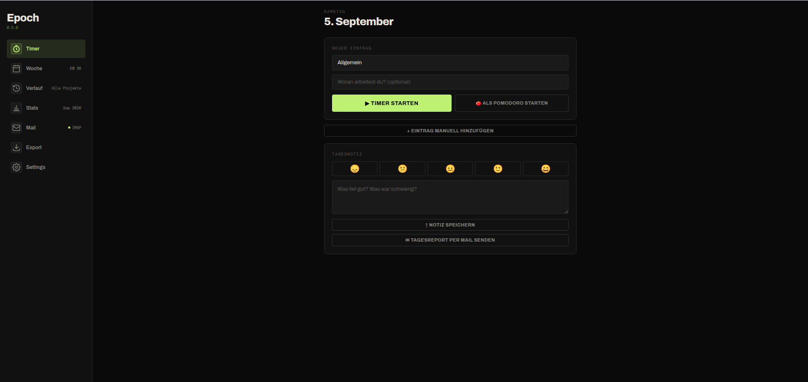
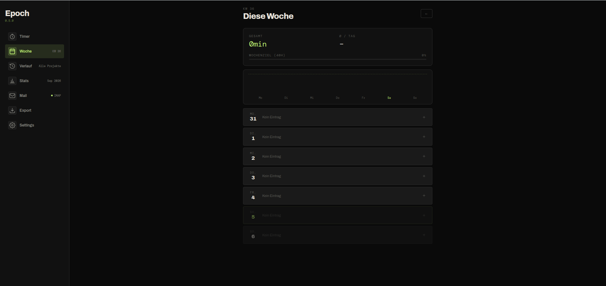
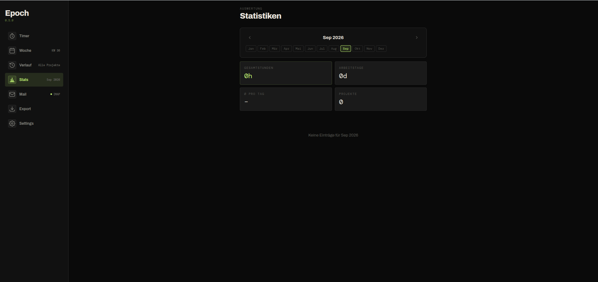
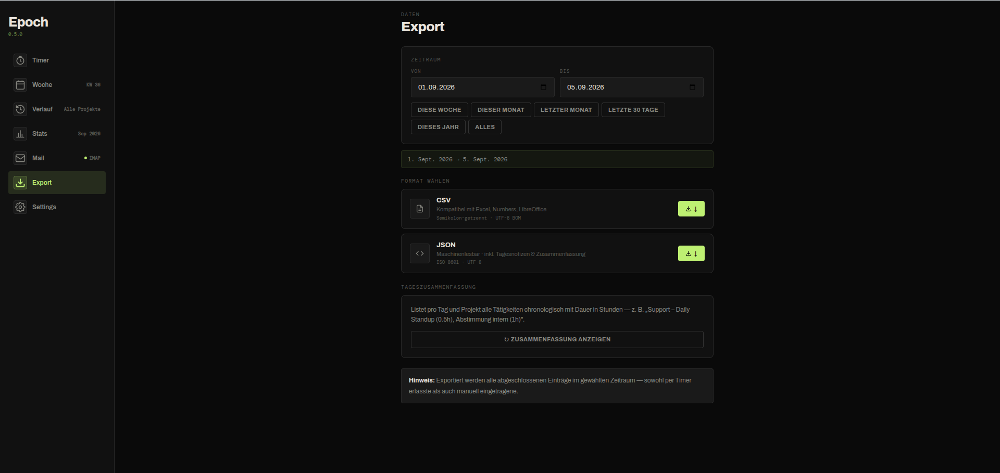
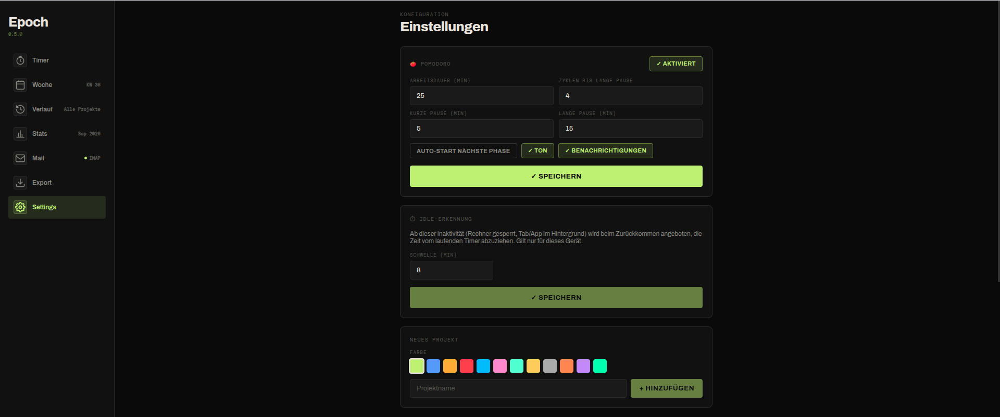

# Epoch

Selbstgehostete Zeiterfassung für den privaten Gebrauch — läuft komplett lokal per Docker Compose, ist über Browser und Handy (PWA) erreichbar, und alle Daten bleiben auf dem eigenen Rechner/Server (SQLite, kein Cloud-Dienst).



## Screenshots

| Wochenübersicht | Statistiken |
|---|---|
|  |  |

| Export | Einstellungen |
|---|---|
|  |  |

## Was ist Epoch?

Epoch ist eine schlanke Web-App, um Arbeitszeit projektbezogen zu erfassen — per Timer, Pomodoro oder manuellem Eintrag. Sie läuft im eigenen Netzwerk (kein externer Dienst, keine Registrierung), lässt sich auf dem Handy als PWA installieren und synct den laufenden Timer automatisch zwischen mehreren Geräten (z. B. Laptop und Handy gleichzeitig offen).

**Die wichtigsten Funktionen:**

- **Timer & Pomodoro** — Start/Pause/Stop, Cross-Device-Sync (Timer läuft auf allen offenen Geräten synchron mit), Pomodoro-Modus mit konfigurierbaren Phasen
- **Manuelle Einträge** — nachträglich erfassen oder bestehende Einträge bearbeiten
- **Wochenübersicht** — Balkendiagramm über die letzten 7 Tage
- **Verlauf** — durchsuchbar nach Zeitraum, Projekt und Aufgabentext
- **Statistiken** — Monatsauswertung, Filterung nach Projekt, Überstunden pro Tag/Projekt
- **Tagesnotiz** — Freitext + Stimmungs-Tracker pro Tag
- **Export** — CSV und JSON, plus automatisch generierte Tageszusammenfassung als Text
- **E-Mail-Integration** — Tagesreport per SMTP versenden, Zeiteinträge per IMAP-Mail importieren
- **Schwebendes Fenster** — Timer/Pomodoro als Picture-in-Picture-Widget, unabhängig vom Browser-Tab (Desktop-Chromium)
- **Idle-Erkennung** — schlägt vor, Inaktivitätszeit vom laufenden Timer abzuziehen
- **Projektverwaltung** — Farben, Reihenfolge, Archivierung statt Löschen

Details zu Datenmodell, API und Implementierung stehen in [claude.md](claude.md).

## Architektur

```
Browser / Handy (PWA)
        │
        ▼
   Nginx :80/:443  (Container "frontend")
        │
        ├── /api/*  ──►  FastAPI :8000  (Container "backend")
        │                     │
        │                SQLite (Bind-Mount ./data)
        │                + IMAP-Polling im Hintergrund
        │
        └── /*      ──►  React SPA (statische Build-Dateien)
```

**Warum getrennte Frontend- und Backend-Container?**

- **Klare Trennung:** Das Backend ([backend/](backend/), FastAPI) kennt nur Datenmodell, Business-Logik und Mail-Integration — keine UI-Abhängigkeiten. Das Frontend ([frontend/](frontend/), React + Vite) ist eine reine SPA, die ausschließlich über die REST-API mit dem Backend spricht.
- **Unabhängige Build-Pipelines:** Der Frontend-Container baut die React-App einmalig zu statischen Dateien (Multi-Stage-Dockerfile: `node` → `nginx`) und liefert sie danach nur noch aus — kein Node-Runtime-Overhead im Betrieb. Das Backend läuft dauerhaft als Python-Prozess.
- **Ein Port nach außen:** Nginx liefert die statischen Frontend-Dateien aus und reicht `/api/*`-Requests transparent an das Backend weiter. Nutzer:innen sehen nur einen Port (3000/3443), intern bleiben beide Dienste sauber getrennt.
- **Austauschbarkeit:** Die REST-API ist die einzige Schnittstelle — das Frontend ließe sich ersetzen (z. B. durch eine native App), ohne das Backend anzufassen.

## Installation

**Voraussetzungen:** Docker + Docker Compose.

```bash
git clone https://github.com/ckoop/epoch.git
cd epoch
docker compose up --build
```

Danach erreichbar unter:

- `http://localhost:3000` — Frontend + API
- `https://localhost:3443` — dasselbe über HTTPS (selbstsigniertes Zertifikat, wird beim ersten Start automatisch erzeugt — Browser-Warnung einmalig bestätigen)
- `http://<lokale-IP>:3000` — Zugriff vom Handy im selben WLAN

Alle Daten liegen danach in `./data` (SQLite-Datenbank + TLS-Zertifikat).

### Konfiguration (optional)

E-Mail-Versand/-Empfang ist optional — ohne Konfiguration ist die App voll nutzbar, nur die Mail-Seite bleibt inaktiv. Für den Mail-Report per SMTP/IMAP eine `.env` im Projekt-Root anlegen:

```env
# SMTP – ausgehende Mails (Tagesreport)
SMTP_HOST=mail.example.com
SMTP_PORT=587
SMTP_USER=epoch@example.com
SMTP_PASSWORD=secret
SMTP_TLS=true
MAIL_FROM=epoch@example.com
MAIL_TO=du@example.com

# IMAP – eingehende Mails (Zeiteintrag per Mail)
IMAP_HOST=mail.example.com
IMAP_PORT=993
IMAP_USER=epoch@example.com
IMAP_PASSWORD=secret
IMAP_FOLDER=INBOX
IMAP_POLL_INTERVAL=3600

# Für welche Hostnamen/IPs das selbstsignierte TLS-Zertifikat gültig sein soll
SSL_SAN=DNS:localhost,IP:127.0.0.1
```

Nach Änderungen an der `.env`: `docker compose up --build` erneut ausführen.

## Tech-Stack

| Schicht    | Technologie                                    |
|------------|-------------------------------------------------|
| Backend    | FastAPI + SQLAlchemy + Uvicorn                  |
| Datenbank  | SQLite                                          |
| Frontend   | React + React Router + Vite                     |
| Charts     | Recharts                                        |
| Serving    | Nginx (Static Files + Reverse Proxy)            |
| Container  | Docker Compose                                  |

## Hinweise

- **Keine Authentifizierung** — gedacht für den Betrieb im eigenen Netzwerk. Bei Zugriff aus dem Internet vorher Basic Auth o. Ä. vorschalten.
- **Einzelnutzer-Betrieb** — SQLite ist nicht auf parallele Schreibzugriffe mehrerer Nutzer:innen ausgelegt.

Für alle weiteren Details (Datenbankschema, vollständige API-Referenz, Implementierungsdetails) siehe [claude.md](claude.md).
